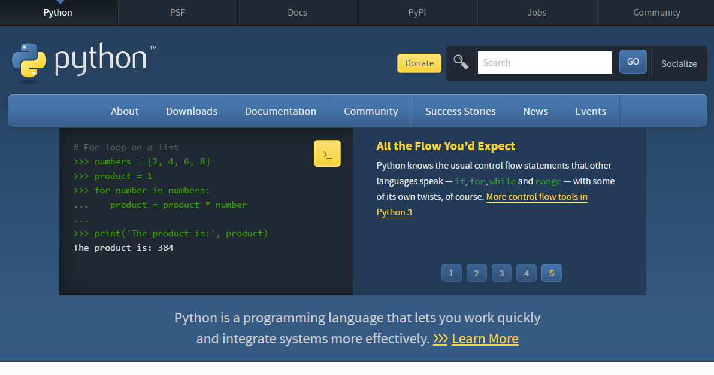
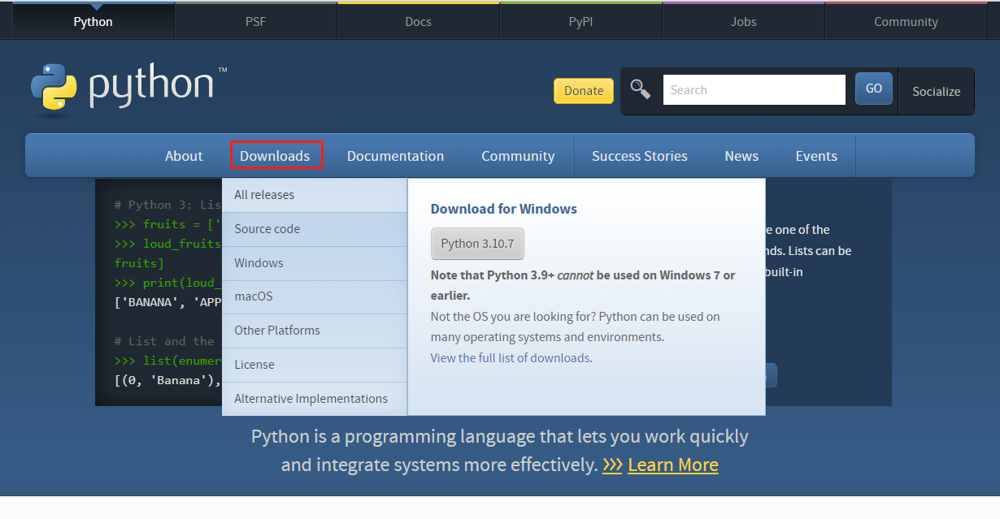
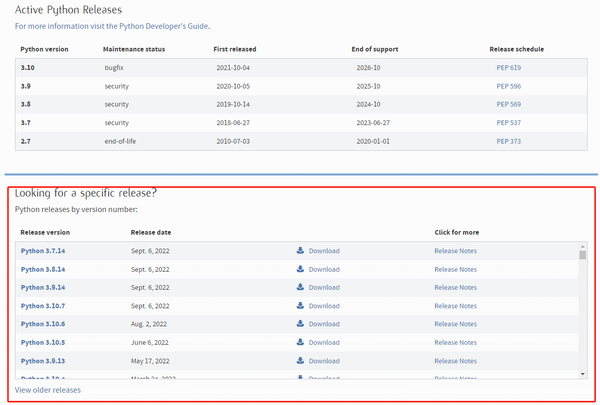
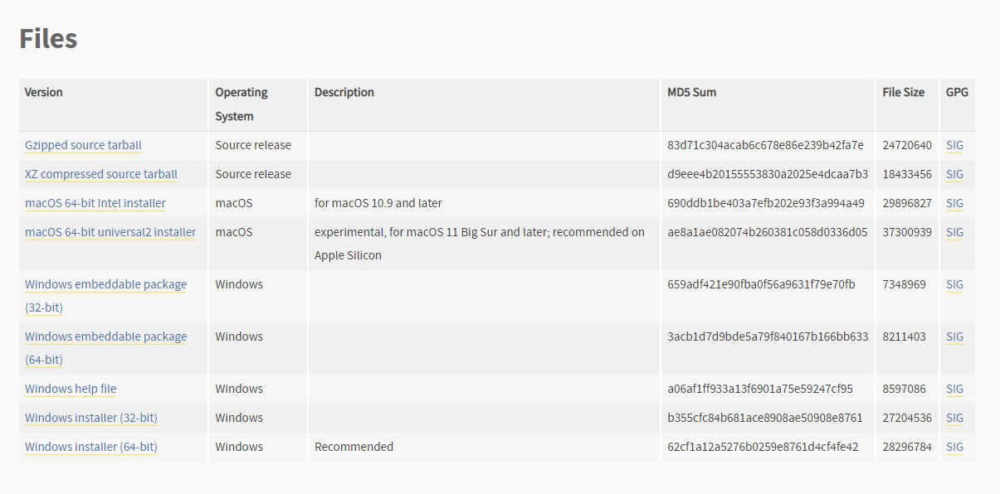
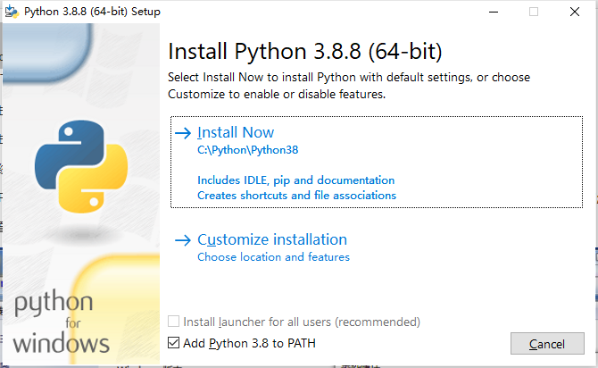

## Python环境搭建


### 版本选择

首先我们打开[Python 的官网 https://www.python.org/](https://www.python.org/) 



这时我们点击 Download 



这里大家可以选择最新的版本进行下载，当然，你也可以点击 All release 选择你想要下载的版本，在这里我们会找到所有的版本（小编这里选择的是3.8的活跃版本）



进入想要下载的版本后，在最下方会出现，如下的选择，这里根据自己的系统选择版本即可



### Python 环境搭建

这里小编以 Windows的安装为例，点击刚刚我们下载好的软件即可



这里我们勾选了将 Python添加到系统的环境变量中，然后根据提示选择下一步就可，安装完成后，打开CMD，输入 python --version ，这是会输出您安装的python的版本号，如果未出现，大家可以重新配置一下您的python的环境变量

>  在环境变量中添加Python目录：
> **在命令提示框中(cmd) :** 输入
> 
> ```
> path=%path%;C:\Python 
> ```
> 
> 按下 **Enter**。
> 
> **注意:** C:\Python 是Python的安装目录。
> 
> 也可以通过以下方式设置：
> 
> - 右键点击"计算机"，然后点击"属性"
> - 然后点击"高级系统设置"
> - 选择"系统变量"窗口下面的"Path",双击即可！
> - 然后在"Path"行，添加python安装路径即可(我的D:\Python32)，所以在后面，添加该路径即可。 **ps：记住，路径直接用分号"；"隔开！**
> - 最后设置成功以后，在cmd命令行，输入命令"python"，就可以有相关显示。
> 
> 
> 
> ------
>  **Python 环境变量**
> 
> 下面几个重要的环境变量，它应用于Python：
> 
> | 变量名        | 描述                                                         |
> | :------------ | :----------------------------------------------------------- |
> | PYTHONPATH    | PYTHONPATH是Python搜索路径，默认我们import的模块都会从PYTHONPATH里面寻找。 |
> | PYTHONSTARTUP | Python启动后，先寻找PYTHONSTARTUP环境变量，然后执行此变量指定的文件中的代码。 |
> | PYTHONCASEOK  | 加入PYTHONCASEOK的环境变量, 就会使python导入模块的时候不区分大小写. |
> | PYTHONHOME    | 另一种模块搜索路径。它通常内嵌于的PYTHONSTARTUP或PYTHONPATH目录中，使得两个模块库更容易切换。 |
> 