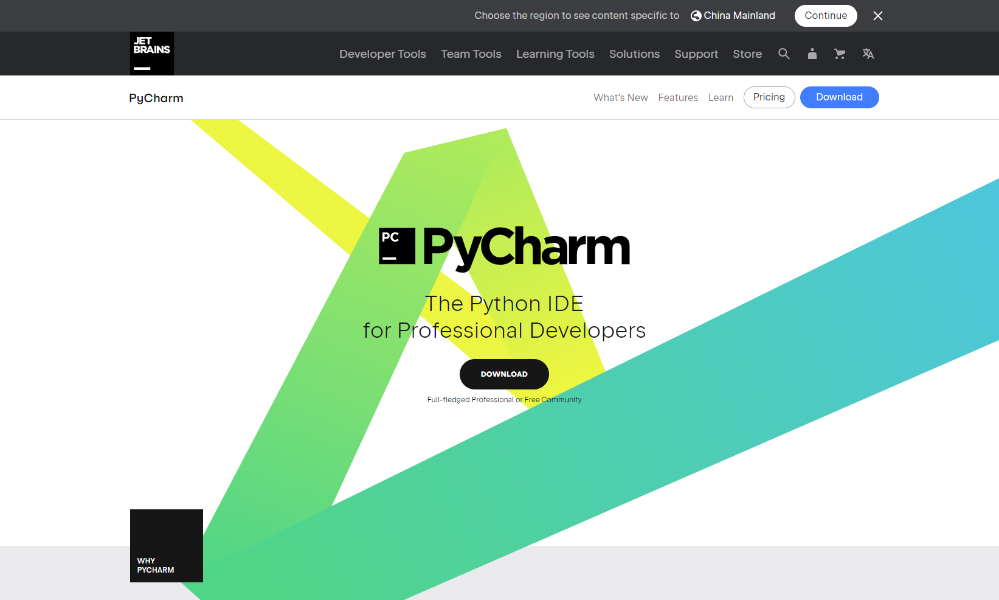
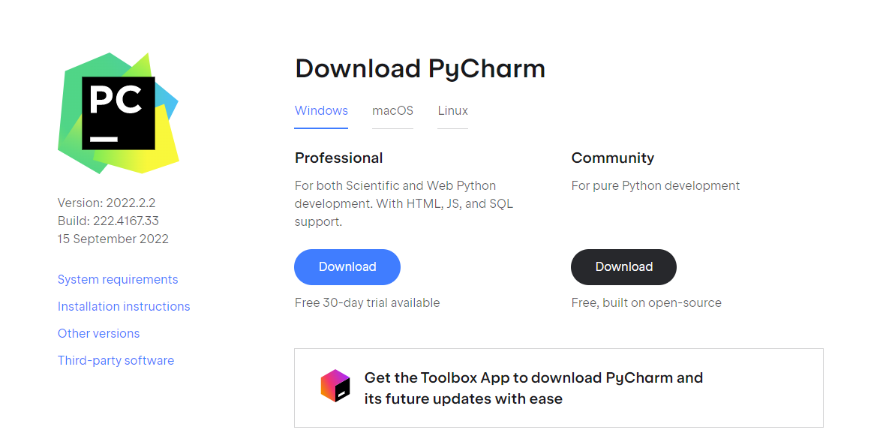
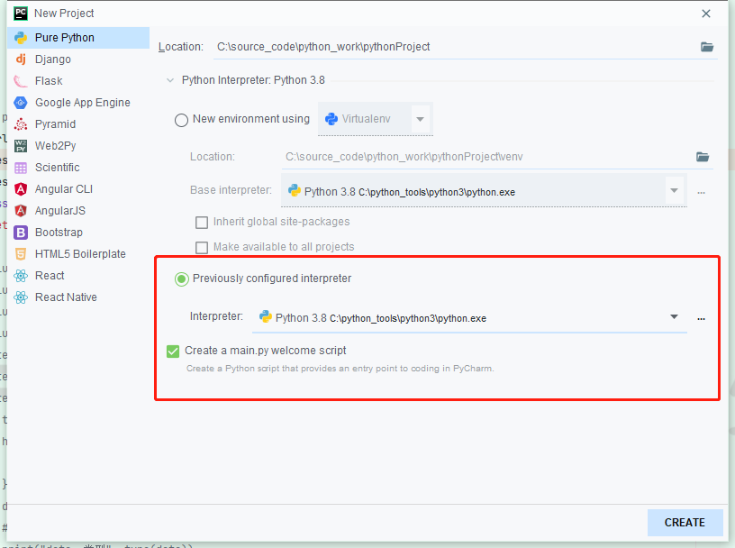
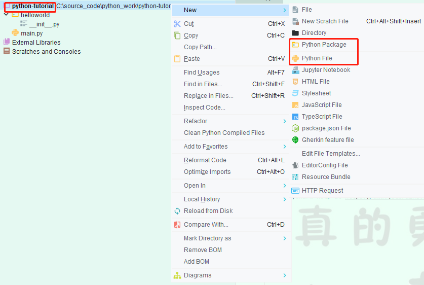
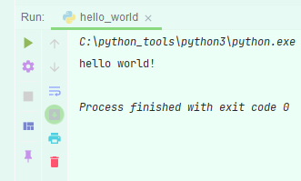

## 第一个Python 程序

> 在前面我们已经安装好了Python的开发环境，本次我们将写一个python的第一个入门示例，在写python之前我们应该选择一个适合自己的开发的IDEA工具，这里小编选择了 PyCharm

###  安装Pycharm

- 下载Pycharm

  [Pycharm 官网 https://www.jetbrains.com/pycharm/](https://www.jetbrains.com/pycharm/)





这里点解Download 即可，不过Professional 是需要付费的，免费使用30天！

- Pycharm 环境配置

  当大家打开Pycharm 首次创建项目时，需要配置一个 interpreter ，这里选择自己安装的python位置即可

  

###  第一个Python程序

项目创建好了，让我来写一个程序 hello world

点击项目，右键创建一个python file ，这里的名字大家可以随意起



```py
#!/usr/bin/env python
# coding=utf-8

"""
<p>

</p>
@author: hai ji
@file: hello_world.py
@date: 2022/9/18 
"""

if __name__ == '__main__':
	# python 内置的函数
    print("hello world!") # 将在控制太输出 hello world

```



