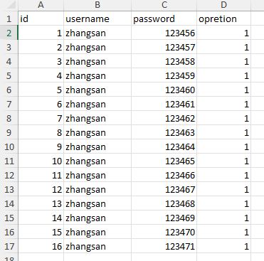
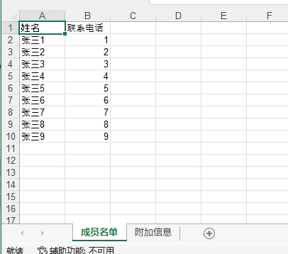
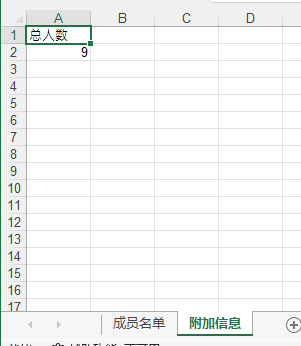

## python操作excel

数据处理是 Python 的一大应用场景，而 Excel 又是当前最流行的数据处理软件。因此用 Python 进行数据处理时，很容易会和 Excel 打起交道。得益于前人的辛勤劳作，Python 处理 Excel 已有很多现成的轮子，比如 xlrd & xlwt & xlutils 、 XlsxWriter 、 OpenPyXL ，而在 Windows 平台上可以直接调用 Microsoft Excel 的开放接口，这些都是比较常用的工具，还有其他一些优秀的工具这里就不一一介绍，接下来我们通过一个表格展示各工具之间的特点：

| 类型   | xlrd&xlwt&xlutils | XlsxWriter | OpenPyXL | Excel开放接口 |
| :----- | :---------------- | :--------- | :------- | :------------ |
| 读取   | 支持              | 不支持     | 支持     | 支持          |
| 写入   | 支持              | 支持       | 支持     | 支持          |
| 修改   | 支持              | 不支持     | 支持     | 支持          |
| xls    | 支持              | 不支持     | 不支持   | 支持          |
| xlsx   | 高版本支持        | 支持       | 支持     | 支持          |
| 大文件 | 不支持            | 支持       | 支持     | 不支持        |
| 效率   | 快                | 快         | 快       | 超慢          |
| 功能   | 较弱              | 强大       | 一般     | 超强大        |

本文将主要介绍下最常用的 xlrd & xlwt & xlutils 系列工具的使用

### xlrd & xlwt & xlutils 介绍

xlrd&xlwt&xlutils 顾明思意是由以下三个库组成：

- xlrd：用于读取 Excel 文件；
- xlwt：用于写入 Excel 文件；
- xlutils：用于操作 Excel 文件的实用工具，比如复制、分割、筛选等；

#### 下载相关依赖

```perl
pip install xlrd==1.2.0 xlutils==2.0.0 xlwt==1.3.0
```

这里值得注意的是`xlrd`的版本不易过高，否则将无法支持，如果下载了过高的版本可以执行

```python
pip uninstall xlrd
```

### 读取Excel



```python
def get_excel_data(filename, sheet_name):
    """
    读取excel文件
    :param filename:  文件名
    :param sheet_name: sheet 名字
    :return:
    """
    # 调用函数，获取当前项目根目录
    project_path = str(pathlib.Path(os.getcwd())) + '/'
    # project_path = os.getcwd() + '/'
    file_path = project_path + filename  # 读取的excel文件路径
    lst_data = []
    work_book = xlrd.open_workbook(file_path)
    work_sheet = work_book.sheet_by_name(sheet_name)
    rows = work_sheet.nrows
    cols = work_sheet.ncols
    for row in range(1, rows):  # 遍历时不取第一行表头内容
        row_list = []
        for col in range(cols):
            cell_data = work_sheet.cell_value(row, col)
            row_list.append(cell_data)  # 每一行的内容都放到一个列表中
        lst_data.append(row_list)  # 把多行内容放到同一个列表中
    return lst_data


if __name__ == '__main__':
    excelList = get_excel_data('red_excel.xlsx', 'Sheet1')
    # print(excelList)
    for a in excelList:
        print(a)
        # for val in a:
        #     print(val)
    # print(str(pathlib.Path(os.getcwd())))
```

输出结果

```java
[1.0, 'zhangsan', 123456.0, 1.0]
[2.0, 'zhangsan', 123457.0, 1.0]
[3.0, 'zhangsan', 123458.0, 1.0]
[4.0, 'zhangsan', 123459.0, 1.0]
[5.0, 'zhangsan', 123460.0, 1.0]
[6.0, 'zhangsan', 123461.0, 1.0]
[7.0, 'zhangsan', 123462.0, 1.0]
[8.0, 'zhangsan', 123463.0, 1.0]
[9.0, 'zhangsan', 123464.0, 1.0]
[10.0, 'zhangsan', 123465.0, 1.0]
[11.0, 'zhangsan', 123466.0, 1.0]
[12.0, 'zhangsan', 123467.0, 1.0]
[13.0, 'zhangsan', 123468.0, 1.0]
[14.0, 'zhangsan', 123469.0, 1.0]
[15.0, 'zhangsan', 123470.0, 1.0]
[16.0, 'zhangsan', 123471.0, 1.0]
```

### 写入Excel

```python
def write_excel(path, filename):
    # 创建 xls 文件对象
    wb = xlwt.Workbook(encoding='utf-8')

    # 新增两个表单页
    sh1 = wb.add_sheet('成员名单')
    sh2 = wb.add_sheet('附加信息')

    # 然后按照位置来添加数据,第一个参数是行，第二个参数是列

    for a in range(10):
        # 写入第一个sheet
        if a == 0:
            sh1.write(0, 0, '姓名')
            sh1.write(0, 1, '联系电话')
        else:
            sh1.write(a, 0, '张三' + str(a))
            sh1.write(a, 1, a)

    # 写入第二个sheet
    sh2.write(0, 0, '总人数')
    sh2.write(1, 0, 9)

    # 最后保存文件即可
    wb.save(filename)


if __name__ == '__main__':
    write_excel(None, 'test.xls')
```

写入结果




