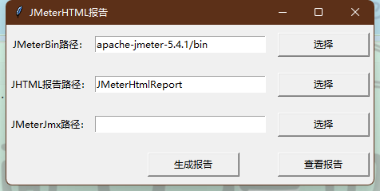

## Python 调用jmeter脚本

JMeter可以通过os命令调用Python脚本，Python同样可以通过系统命令调用JMeter执行压测

首先要确保您的电脑上安装了`Jmeter`，并且配置好了环境变量，否则会执行失败

可以通过`jmeter -v`进行验证，结果如下：

```
    _    ____   _    ____ _   _ _____       _ __  __ _____ _____ _____ ____
   / \  |  _ \ / \  / ___| | | | ____|     | |  \/  | ____|_   _| ____|  _ \
  / _ \ | |_) / _ \| |   | |_| |  _|    _  | | |\/| |  _|   | | |  _| | |_) |
 / ___ \|  __/ ___ \ |___|  _  | |___  | |_| | |  | | |___  | | | |___|  _ <
/_/   \_\_| /_/   \_\____|_| |_|_____|  \___/|_|  |_|_____| |_| |_____|_| \_\ 5.4.3

Copyright (c) 1999-2021 The Apache Software Foundation

```

### 调用jmeter脚本

```python
jmx_file = 'jmx/test01.jmx'  # jmx文件路径
result_file = 'jmx/test01.jtl'  #
log_file = 'run.log'
date = datetime.datetime.now()
# report存放的路径
report_dir = 'report/' + date.strftime("%Y%m%d") + '/' + date.strftime("%H%M%S")
# 不存在则创建
if not os.path.exists(report_dir):
    os.makedirs(report_dir)

run_cmd = f'jmeter -n -t {jmx_file} -l {result_file} -j {log_file}'  # 无界面运行JMeter压测命令
report_cmd = f'jmeter -g {result_file} -o {report_dir}'  # 生成HTML报告命令

# 不需要获取屏幕输出是，可以使用os.system()
# os.system(run_cmd)
# os.system(report_cmd)

# 需要获取屏幕输出是，可以使用subprocess.Popen()
p1 = subprocess.Popen(run_cmd, shell=True, stdout=subprocess.PIPE)
print(p1.stdout.read().decode('utf-8'))
p2 = subprocess.Popen(report_cmd, shell=True, stdout=subprocess.PIPE)
print(p2.stdout.read().decode('utf-8'))
```

[相关源码，以及 jmx可以参考 https://github.com/yanghaiji/python-tutorial](https://github.com/yanghaiji/python-tutorial)

### 封装GUI页面

```python
#!/usr/bin/env python
# coding=utf-8

"""
<p>

</p>
@author: hai ji
@file: test02.py
@date: 2022/11/4 
"""
# _*_coding:utf-8_*_
import json
import tkinter
from tkinter import filedialog  # 这个是文件选择
import tkinter.messagebox  # 这个是消息框，对话框的关键
import datetime
import os

os.system('chcp 65001')

configPath = {
    "JMeterBin": "apache-jmeter-5.4.1/bin",
    "JMeterReport": "JMeterHtmlReport"
}


class Layout(object):

    def __init__(self):
        # 创建主窗口,用于容纳其它组件
        self.root = tkinter.Tk()

        # 获取屏幕长宽
        windowsWidth = self.root.winfo_screenwidth()
        windowsHight = self.root.winfo_screenheight()

        # 指定窗口大小
        Width = 460
        Hight = 200

        # 设置窗口居中展示
        x = (windowsWidth - Width) / 2
        y = (windowsHight - Hight) / 2

        self.root.geometry("%dx%d+%d+%d" % (Width, Hight, x, y))

        # 给主窗口设置标题内容
        self.root.title("JMeterHTML报告")

        # # 创建标签+输入框+按钮
        # 1.1 #----JMeterBin路径------标签
        self.JMeterBinPath = tkinter.Label(self.root, text="JMeterBin路径：", width=15)

        # 1.2 #----JMeterBin路径------输入框
        JMeterBinPath = tkinter.StringVar(value=configPath["JMeterBin"])
        self.JMeterBinPath_input = tkinter.Entry(self.root, width=30, textvariable=JMeterBinPath)

        # 1.3 #----JMeterBin路径------按钮
        self.JMeterBinPath_button = tkinter.Button(self.root, text="选择", width=15, height=1,
                                                   command=lambda: self.act("JMeterBinPath_button"))

        # 2.1 #----JMeterJmx路径------标签
        self.JMeterJmxPath = tkinter.Label(self.root, text="JMeterJmx路径：", width=15)

        # 2.2 #----JMeterJmx路径------输入框
        self.JMeterJmxPath_input = tkinter.Entry(self.root, width=30)

        # 2.3 #----JMeterJmx路径------按钮
        self.JMeterJmxPath_button = tkinter.Button(self.root, text="选择", width=15, height=1,
                                                   command=lambda: self.act("JMeterJmxPath_button"))

        # 3.1 #----JMeterReport路径------标签
        self.JMeterReportPath = tkinter.Label(self.root, text="JHTML报告路径：", width=15)

        # 3.2 #----JMeterReport路径------输入框
        JMeterReportPath = tkinter.StringVar(value=configPath["JMeterReport"])
        self.JMeterReportPath_input = tkinter.Entry(self.root, width=30, textvariable=JMeterReportPath)

        # 3.3 #----JMeterReport路径------按钮
        self.JMeterReport_button = tkinter.Button(self.root, text="选择", width=15, height=1,
                                                  command=lambda: self.act("JMeterReport_button"))

        # 创建生成报告按钮
        self.MakeReport_button = tkinter.Button(self.root, text="生成报告", width=15, height=1,
                                                command=lambda: self.act("MakeReport_button"))

        # 创建查看报告按钮
        self.ReadReport_button = tkinter.Button(self.root, text="查看报告", width=15, height=1,
                                                command=lambda: self.act("ReadReport_button"))

    # 完成布局
    def gui_arrang(self):
        self.JMeterBinPath.grid(row=0, column=0, sticky='w', pady=10)  # sticky='w'指定了组件在单元格中靠左对齐
        self.JMeterBinPath_input.grid(row=0, column=1, pady=10)
        self.JMeterBinPath_button.grid(row=0, column=3, padx=15, pady=10)

        self.JMeterReportPath.grid(row=1, column=0, sticky='w', pady=10)  # sticky='w'指定了组件在单元格中靠左对齐
        self.JMeterReportPath_input.grid(row=1, column=1, pady=10)
        self.JMeterReport_button.grid(row=1, column=3, padx=15, pady=10)

        self.JMeterJmxPath.grid(row=2, column=0, sticky='w', pady=10)  # sticky='w'指定了组件在单元格中靠左对齐
        self.JMeterJmxPath_input.grid(row=2, column=1, pady=10)
        self.JMeterJmxPath_button.grid(row=2, column=3, padx=15, pady=10)

        self.MakeReport_button.grid(row=3, column=0, rowspan=3, columnspan=5, padx=15, pady=10)
        self.ReadReport_button.grid(row=5, column=3, rowspan=3, columnspan=5, padx=15, pady=10)

    def act(self, buttonName):
        self.inputList = [self.JMeterBinPath_input, self.JMeterJmxPath_input, self.JMeterReportPath_input]
        if buttonName == "JMeterBinPath_button":
            folderPath = filedialog.askdirectory()
            self.inputList[0].delete(0, tkinter.END)
            self.inputList[0].insert(0, folderPath)
            # if data["JMeterBin"] != folderPath:
            #     ReadConfig("config.json").wrid_json("JMeterBin", folderPath)
            # else:
            #     pass

        elif buttonName == "JMeterJmxPath_button":
            folderPath = filedialog.askopenfilename(filetypes=[('JMX', 'jmx')])
            self.inputList[1].delete(0, tkinter.END)
            self.inputList[1].insert(0, folderPath)

        elif buttonName == "JMeterReport_button":
            folderPath = filedialog.askdirectory()
            self.inputList[2].delete(0, tkinter.END)
            self.inputList[2].insert(0, folderPath)
            # if ReadConfig("config.json").read_json()["JMeterReport"] != folderPath:
            #     ReadConfig("config.json").wrid_json("JMeterReport", folderPath)
            # else:
            #     pass

        elif buttonName == "MakeReport_button":
            # 获取三个路径值
            JMeterBinPath = self.inputList[0].get()
            JMeterJmxPath = self.inputList[1].get()
            JMeterReportPath = self.inputList[2].get()

            if JMeterBinPath == "" or JMeterJmxPath == "" or JMeterReportPath == "":
                tkinter.messagebox.showinfo('提示', '请正确选择路径！')
            else:
                # 获取Bin目录的根磁盘
                cdBinRootPath = JMeterBinPath[0] + ":"

                # 移动至Bin目录
                cdBinPath = "cd " + JMeterBinPath

                # 生成Html报告命令
                nowTime = datetime.datetime.now().strftime('%Y-%m-%d-%H-%M-%S')  # 时间戳
                makeReport = "jmeter -n -t " + JMeterJmxPath + " -l " + JMeterReportPath + "/report-" + nowTime + "/report.jtl -e -o " + JMeterReportPath + "/report-" + nowTime + " 2>&1"

                # print(os.popen("C: & cd C:/Jmeter/apache-jmeter-5.2/bin & jmeter -n -t C:/Users/jinxiao.lu/Desktop/JMeter/察看结果树.jmx -l C:/Users/jinxiao.lu/Desktop/JMeter/test.jtl -e -o C:/Users/jinxiao.lu/Desktop/JMeter/report"))
                content = os.popen(cdBinRootPath + "&" + cdBinPath + "&" + makeReport).read()
                print(content)
                BinPathEorr = "'jmeter' is not recognized as an internal or external command"

                if "... end of run" in content:
                    tkinter.messagebox.showinfo('提示', '生成报告成功')
                    # ReadConfig("config.json").wrid_json("JMeterBin", JMeterBinPath)
                    # ReadConfig("config.json").wrid_json("JMeterReport", JMeterReportPath)

                elif BinPathEorr in content:
                    tkinter.messagebox.showerror('错误', "JMeterBin路径错误！")
                else:
                    tkinter.messagebox.showerror('错误', '出错了\n' + content)

        elif buttonName == "ReadReport_button":
            JMeterReportPath = self.inputList[2].get()
            os.startfile(JMeterReportPath)
        else:
            print("按钮名字错误")


class ReadConfig(object):

    def __init__(self, filename):
        self.filepath = "../config/" + filename

    def read_json(self):
        with open(self.filepath, "r", encoding="utf-8") as f:
            # 调用load方法加载文件流

            return json.load(f)

    def wrid_json(self, pathKey, pathVarlue):

        # 加载Json数据
        # 替换路径值
        for key in configPath:
            if pathKey == key:
                configPath[key] = pathVarlue
        return configPath


def main():
    # 初始化对象
    Report = Layout()
    # 进行布局
    Report.gui_arrang()
    # 主程序执行
    tkinter.mainloop()


if __name__ == "__main__":
    main()


```

运行项目显示如下:



根据自己环境进行选择后进行生成报告，也可以一件查看报告